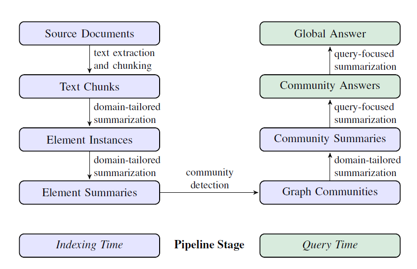

# Graph RAG
## 研究动机
1. 人类往往能够根据大量文档，得出一些原本在文档中没被明确阐述的结论和想法 (sensemaking)。
2. 当前的RAG是为了解决那些能够在文本片段中找到答案的问答任务而设计的，对于QFS (query focus summarization，使用自然语言对内容进行概括而非单纯地生成文本片段)任务不一定适用。
3. 对于那些针对整个数据集进行提问的场景 (如：“这个数据集主要讲了哪些主要内容？”)，原有的RAG方法显然无法将所有数据放入上下文中并让大模型总结；即便能放入上下文窗口，由于lost in the middle (另一篇探索上下文信息丢失的论文)现象的存在，LLM总结效果不一定好。

## 核心思路
使用LLM根据语料构建知识图谱；使用community detection算法将知识图谱的节点划分为多个communities；使用LLM提前对每个community进行总结；问答时，根据每个community的总结内容，并行回答同一个问题得到多个局部答案 (partial answer)；然后再将所有局部答案再次总结得到全局答案 (global answer)。

## 具体流程

### 1. Source Documents → Text Chunks
**文档分块**
- 将文档分为多个chunks，每个chunk都通过特殊设计的prompt被输进LLM，提取构建知识图谱的节点和边。
- 实验结果表名，chunk越大，需要调用LLM的总次数就越少，但是太大的chunk会导致信息丢失；使用小chunk能够提取到更多、更精细的图谱信息，效果更好。**实际使用中需要权衡。**

### 2. Text Chunks → Element Instances
**抽取节点和边**
- 分阶段，先让LLM从文本片段中找到所有的实体 (包括其名称、类型、描述)，然后再识别出实体之间的关系 (包括头节点、目标节点、关系描述)。
- 抽取的prompt中如果加入few-shot例子，有助于在特定的领域任务提升效果 (如法律、医疗等领域)。
- 使用二次抽取prompt来提取节点相关的信息 (论文中称为covariates，协变量)，比如节点的描述、原文本范围、开始结束日期等 (论文中的表述为：covariate prompt aims to extract claims linked to detected entities, including the subject, object, type， description, source text span, and start and end dates)
- 如上文提到，太长的文本chunk可能会导致LLM漏掉许多信息，因此作者使用了多轮抽取的策略：每次抽取后，评估一下是否已经将所有实体抽取完了。如果没有，再次提示LLM继续抽取。这个策略在论文中被称为**gleanings**。此策略能使用更大的chunk size，同时效果也能保持不变。

### 3. Element Instances → Element Summaries
**通过LLM，为上述步骤提取到的实体、关系等图元素生成文字描述**
- 此步骤生成的总结被称为element summary，即对每个节点、边等元素的summary。
- 由于LLM可能对同一个实体有不同的描述 (名称不同)，可能会出现冗余实体。但是因为后续方法会将实体划分为多个communities，并对每个community做总结，且LLM有理解“不同的名字的实体可能本质上是同一回事”的能力，因此冗余实体这种情况无伤大雅。
- 此步骤体现了GraphRAG和传统知识图谱的区别：GraphRAG用文本描述来代表同构节点并构建图索引，而传统知识图谱需要准确的三元组。

### 4. Element Summaries → Graph Communities
**将图节点划分为多个communities**
- 前置步骤构建的图是一个同构、无向有权图，权重表示的是"the normalized counts of detected relationship instances"。(此处存疑，或许是某类型的边的数量/所有边的数量)
- 可以使用多种不同的community detection算法来划分community，GraphRAG使用的是**Leiden**算法。
- 据论文说，Leiden算法能够高效地恢复大规模图的层次社区结构 (hierarchical community structure)；该结构的每一层中的社区划分方式都是“互斥、集合穷尽”的 (个人理解就是以不同粒度划分community，因此是分层的；同时每一层都覆盖了所有节点，且不会有重叠的部分)。

### 5. Graph Communities → Community Summaries
**对每个community生成总结文本**
1. Leaf-level communities：细粒度的总结。
 - 在社区中，按照排列顺序逐渐将图的元素加入之LLM上下文窗口，直至达到限制，然后让LLM生成总结。
 - 排列顺序如下：对于社区中的每条边，将其源节点和目标节点的度加在一起作为这条边的分数，以降序排列；在将每条边加入至LLM上下文窗口时，先添加源节点的description，然后是目标节点的description，然后是covariates，最后是这条边本身。
2. Higher-level communities：粗粒度总结 (对高层级的community进行总结，因为高层级中划分的community数量少，每个community包含的节点多)。
 - 如果所有节点都能放进LLM的上下文窗口，那么方法和Leaf-level一样，否则执行下述流程。
 - 将该community下的sub-community按照其中包含的element summary的总token数降序排列
 - 将token最多的sub-community中的element summary，替换为sub-community的总体summary。
 - 重复上述步骤直至所有内容能够放入LLM的上下文窗口。

### 6. Community Summaries → Community Answers → Global Answer
**根据多个community summary生成多个中间答案，然后汇总中间答案生成最终答案**  
对于一个给定的社区层级：
- 将所有community summary随机打乱，并且切分为多个预设大小的chunk。该步骤主要是保证与问题相关的信息不会过分集中在某一个上下文窗口中，从而造成信息丢失丢失 (可能还是跟lost in the middle的现象相关，即所有信息放在一大段中，LLM回答时直接漏掉中间信息)。
- 根据每一个chunk，都生成一个针对query的中间答案 (intermediate answer)，同时模型需要对这个答案打分 (0-100)，用于表示该答案对生成最终答案的帮助程度。0分答案直接过滤。
- 中间答案根据分数降序排列，然后放入LLM的上下文窗口，直至达到token限制。最后让LLM根据这些中间答案回答query，得到最终答案 (global answer)。

## 疑问
- 实际问答时，应该取哪个层级的community来生成答案？还是说每一层都获得一个global answer，然后汇总所有global answer得到一个global global answer？
- 是否可以前置一个分类环节，针对问题的类型等信息，决定从从哪一层获取答案？如果可以，如何做分类？
